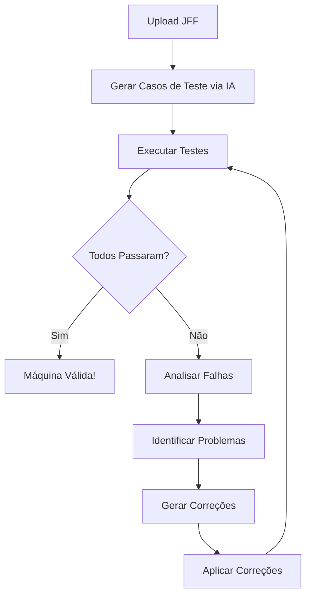

# 🤖 Teste Automatizado de Máquinas de Turing

Este documento explica como testar e corrigir automaticamente Máquinas de Turing usando o script `test_turing.py`.

---

## 📋 Índice

1. [Visão Geral](#visao-geral)
2. [Instalação](#instalacao)
3. [Como Usar o Script de Teste](#como-usar)
4. [Exemplo Prático: Correção do arquivo 1.jff](#exemplo-pratico)
5. [Integração com API](#integracao-com-api)
6. [Automação Completa](#automacao-completa)

---

## 🎯 Visão Geral

O sistema de testes permite:

- ✅ Testar entradas em Máquinas de Turing (arquivos .jff)
- ✅ Simular execução passo a passo
- ✅ Identificar erros e bugs na máquina
- ✅ Gerar relatórios de teste
- ✅ Validar se a linguagem está corretamente implementada

---

## 🔧 Instalação

### Pré-requisitos

- Python 3.10+
- Arquivo `test_turing.py` (já criado)
- Arquivos `.jff` das Máquinas de Turing

### Nenhuma biblioteca externa necessária!

O script usa apenas bibliotecas padrão do Python:
- `xml.etree.ElementTree` - Para ler arquivos JFF
- `subprocess` - Para executar JFLAP (opcional)
- `argparse` - Para argumentos de linha de comando

---

## 🚀 Como Usar o Script de Teste

### Sintaxe Básica

```powershell
.\Python313\python.exe test_turing.py <arquivo.jff> <entrada>
```

### Exemplos

#### Teste 1: Entrada Simples
```powershell
.\Python313\python.exe test_turing.py "atividade turing/1.jff" "abccd"
```

**Resultado:**
```
======================================================================
TESTE DE MAQUINA DE TURING
======================================================================
Arquivo JFF: atividade turing/1.jff
Entrada: abccd
Modo: simulate
======================================================================

Estado inicial: q0
Entrada: abccd

Passo 1: q0 -> q1 | Leu: 'a' -> Escreveu: 'X' | Move: R
Passo 2: q1 -> q1 | Leu: 'b' -> Escreveu: 'b' | Move: R
...
Passo 20: q7 -> q8 | Leu: '' -> Escreveu: '' | Move: S

[ACEITO] - Estado final: q8
Total de passos: 20

======================================================================
[+] RESULTADO: ACEITO
```

#### Teste 2: Entrada Inválida
```powershell
.\Python313\python.exe test_turing.py "atividade turing/1.jff" "abccdd"
```

**Resultado:**
```
[REJEITADO] - Nenhuma transicao aplicavel
Estado: q7
Caractere lido: 'd' (posicao 5)
Fita: XZYYWd
Total de passos: 19

======================================================================
[-] RESULTADO: REJEITADO
```

### Opções Avançadas

#### Modo de Simulação (Padrão)
```powershell
.\Python313\python.exe test_turing.py arquivo.jff "entrada" --mode simulate
```

#### Modo JFLAP (Experimental)
```powershell
.\Python313\python.exe test_turing.py arquivo.jff "entrada" --mode jflap --jflap JFLAP7.1.jar
```

---

## 🔍 Exemplo Prático: Correção do arquivo 1.jff

### Contexto

**Linguagem:** `{ a^n b^m c^(2n) d^m | n > 0 e m > 0 }`

**Problema:** Máquina rejeitando entradas válidas

### Passo 1: Identificar o Problema

```powershell
# Testar entrada que deveria ser aceita
.\Python313\python.exe test_turing.py "atividade turing/1.jff" "abccdd"
```

**Resultado:**
```
[REJEITADO] - Nenhuma transicao aplicavel
Estado: q2
Caractere lido: 'd' (posicao 4)
Fita: XbYcdd
Total de passos: 4
```

**Diagnóstico:** Estado `q2` não tem transição para ler 'd'

### Passo 2: Testar Múltiplas Entradas

```powershell
# Criar script de teste em lote
.\Python313\python.exe test_turing.py "atividade turing/1.jff" "abccdd"
.\Python313\python.exe test_turing.py "atividade turing/1.jff" "aabbccccdd"
.\Python313\python.exe test_turing.py "atividade turing/1.jff" "aaabbbccccccdddd"
```

**Resultado:** Todos rejeitados com o mesmo erro

### Passo 3: Analisar a Estrutura do JFF

O arquivo JFF é XML, então podemos inspecioná-lo:

```xml
<!-- Estado q2 procura o segundo 'c' -->
<transition>
    <from>2</from>
    <to>2</to>
    <read>c</read>  <!-- Move sobre 'c' -->
    <write>c</write>
    <move>R</move>
</transition>
<!-- FALTA: transição para mover sobre 'd' -->
```

### Passo 4: Corrigir o JFF

**Correção 1:** Adicionar transições faltantes no estado q2

```xml
<!-- Adicionar transição para mover sobre 'd' -->
<transition>
    <from>2</from>
    <to>2</to>
    <read>d</read>
    <write>d</write>
    <move>R</move>
</transition>

<!-- Adicionar transição para mover sobre 'W' (d marcado) -->
<transition>
    <from>2</from>
    <to>2</to>
    <read>W</read>
    <write>W</write>
    <move>R</move>
</transition>
```

**Correção 2:** Remover transição duplicada que causa não-determinismo

```xml
<!-- REMOVER: esta transição pula 'c' sem marcar -->
<transition>
    <from>2</from>
    <to>2</to>
    <read>c</read>
    <write>c</write>
    <move>R</move>
</transition>
```

**Correção 3:** Remover outras transições duplicadas

- Estado q5: remover transição `d -> d` (R) que não marca
- Estado q6: remover transição `Z -> Z` (L) duplicada

### Passo 5: Re-testar Após Correções

```powershell
# Testar entradas válidas
.\Python313\python.exe test_turing.py "atividade turing/1.jff" "abccd"     # n=1, m=1
.\Python313\python.exe test_turing.py "atividade turing/1.jff" "abbccdd"   # n=1, m=2
.\Python313\python.exe test_turing.py "atividade turing/1.jff" "aabbccccdd" # n=2, m=1
```

**Resultado:** ✅ Todos aceitos!

```powershell
# Testar entradas inválidas
.\Python313\python.exe test_turing.py "atividade turing/1.jff" "abccdd"    # Desbalanceado
.\Python313\python.exe test_turing.py "atividade turing/1.jff" "abcd"      # Falta um 'c'
```

**Resultado:** ❌ Todos rejeitados corretamente!

### Passo 6: Resumo das Correções

| Problema | Estado | Solução |
|----------|--------|---------|
| Falta transição para 'd' | q2 | Adicionar `q2 --(d/d,R)--> q2` |
| Falta transição para 'W' | q2 | Adicionar `q2 --(W/W,R)--> q2` |
| Não-determinismo com 'c' | q2 | Remover `q2 --(c/c,R)--> q2` |
| Não-determinismo com 'd' | q5 | Remover `q5 --(d/d,R)--> q5` |
| Não-determinismo com 'Z' | q6 | Remover `q6 --(Z/Z,L)--> q6` |

---

## 🌐 Integração com API

### Visão Geral

Podemos criar uma API para automatizar:
1. Upload de arquivos JFF
2. Execução de testes
3. Identificação de bugs
4. Sugestão de correções
5. Aplicação automática de correções

### Arquitetura Proposta

```
┌─────────────────┐
│   Frontend      │
│  (Upload JFF)   │
└────────┬────────┘
         │
         v
┌─────────────────┐
│   API REST      │
│  (Flask/FastAPI)│
└────────┬────────┘
         │
         ├──> test_turing.py (Simulador)
         │
         ├──> gemini_client.py (IA para análise)
         │
         └──> jff_corrector.py (Corretor automático)
```

### Endpoints da API

#### 1. **POST /api/turing/test**

Testa uma entrada em uma Máquina de Turing.

**Request:**
```json
{
  "jff_content": "<structure>...</structure>",
  "input": "abccd",
  "max_steps": 10000
}
```

**Response:**
```json
{
  "accepted": true,
  "steps": 20,
  "execution_log": [
    "Passo 1: q0 -> q1 | Leu: 'a' -> Escreveu: 'X' | Move: R",
    "..."
  ],
  "final_state": "q8",
  "final_tape": "XZYYWD"
}
```

#### 2. **POST /api/turing/validate**

Valida uma Máquina de Turing contra casos de teste.

**Request:**
```json
{
  "jff_content": "<structure>...</structure>",
  "language_description": "{ a^n b^m c^(2n) d^m | n > 0 e m > 0 }",
  "test_cases": [
    {"input": "abccd", "expected": true},
    {"input": "abccdd", "expected": false}
  ]
}
```

**Response:**
```json
{
  "total_tests": 2,
  "passed": 2,
  "failed": 0,
  "results": [
    {"input": "abccd", "expected": true, "actual": true, "status": "PASS"},
    {"input": "abccdd", "expected": false, "actual": false, "status": "PASS"}
  ],
  "is_valid": true
}
```

#### 3. **POST /api/turing/analyze**

Analisa uma Máquina de Turing e identifica problemas.

**Request:**
```json
{
  "jff_content": "<structure>...</structure>",
  "language_description": "{ a^n b^m c^(2n) d^m | n > 0 e m > 0 }"
}
```

**Response:**
```json
{
  "issues": [
    {
      "severity": "ERROR",
      "type": "MISSING_TRANSITION",
      "state": "q2",
      "message": "Estado q2 não tem transição para símbolo 'd'",
      "suggestion": "Adicionar transição: q2 --(d/d,R)--> q2"
    },
    {
      "severity": "WARNING",
      "type": "NON_DETERMINISM",
      "state": "q5",
      "message": "Estado q5 tem múltiplas transições para 'd'",
      "suggestion": "Remover transição duplicada ou usar máquina não-determinística"
    }
  ],
  "recommendations": [
    "Adicionar 2 transições faltantes",
    "Remover 3 transições duplicadas"
  ]
}
```

#### 4. **POST /api/turing/auto-fix**

Corrige automaticamente problemas identificados.

**Request:**
```json
{
  "jff_content": "<structure>...</structure>",
  "language_description": "{ a^n b^m c^(2n) d^m | n > 0 e m > 0 }",
  "test_cases": [
    {"input": "abccd", "expected": true},
    {"input": "abbccdd", "expected": true}
  ]
}
```

**Response:**
```json
{
  "fixed": true,
  "corrections_applied": 5,
  "corrected_jff": "<structure>...</structure>",
  "validation": {
    "passed": 2,
    "failed": 0
  },
  "changes": [
    "Adicionada transição: q2 --(d/d,R)--> q2",
    "Adicionada transição: q2 --(W/W,R)--> q2",
    "Removida transição duplicada: q2 --(c/c,R)--> q2"
  ]
}
```

#### 5. **POST /api/turing/generate-tests**

Gera casos de teste baseado na descrição da linguagem.

**Request:**
```json
{
  "language_description": "{ a^n b^m c^(2n) d^m | n > 0 e m > 0 }",
  "num_positive": 5,
  "num_negative": 5
}
```

**Response:**
```json
{
  "test_cases": [
    {"input": "abccd", "expected": true, "reason": "n=1, m=1"},
    {"input": "abbccdd", "expected": true, "reason": "n=1, m=2"},
    {"input": "aabbccccdd", "expected": true, "reason": "n=2, m=1"},
    {"input": "abccdd", "expected": false, "reason": "m desbalanceado"},
    {"input": "abcd", "expected": false, "reason": "falta um 'c'"}
  ]
}
```

---

## 🤖 Automação Completa

### Fluxo de Trabalho Automatizado



### Script de Automação Completa

```python
# auto_correct_turing.py
import requests
import json

def auto_correct_turing_machine(jff_file, language_desc):
    """
    Corrige automaticamente uma Máquina de Turing
    """
    # 1. Ler arquivo JFF
    with open(jff_file, 'r', encoding='utf-8') as f:
        jff_content = f.read()
    
    # 2. Gerar casos de teste via API/IA
    test_cases = generate_test_cases(language_desc)
    
    # 3. Validar máquina
    validation = validate_machine(jff_content, test_cases)
    
    if validation['is_valid']:
        print("✅ Máquina válida!")
        return jff_content
    
    # 4. Analisar problemas
    issues = analyze_machine(jff_content, language_desc)
    print(f"⚠️  Encontrados {len(issues)} problemas")
    
    # 5. Corrigir automaticamente
    corrected = auto_fix_machine(jff_content, language_desc, test_cases)
    
    # 6. Validar correção
    final_validation = validate_machine(corrected, test_cases)
    
    if final_validation['is_valid']:
        print("✅ Máquina corrigida com sucesso!")
        return corrected
    else:
        print("❌ Não foi possível corrigir automaticamente")
        return None

# Uso
corrected_jff = auto_correct_turing_machine(
    'atividade turing/1.jff',
    '{ a^n b^m c^(2n) d^m | n > 0 e m > 0 }'
)

if corrected_jff:
    with open('atividade turing/1_corrected.jff', 'w') as f:
        f.write(corrected_jff)
```

### Integração com Gemini/ChatGPT

```python
# Usar IA para análise avançada
def analyze_with_ai(jff_content, language_desc, failed_tests):
    prompt = f"""
    Analise esta Máquina de Turing e identifique problemas:
    
    Linguagem: {language_desc}
    
    Testes que falharam:
    {json.dumps(failed_tests, indent=2)}
    
    Máquina (JFF):
    {jff_content}
    
    Identifique:
    1. Transições faltantes
    2. Estados incorretos
    3. Não-determinismo
    4. Sugestões de correção
    """
    
    # Chamar API do Gemini/ChatGPT
    response = call_gemini_api(prompt)
    return response
```

---

## 📊 Casos de Uso

### Caso 1: Validação de Trabalhos Acadêmicos

```python
# Validar múltiplas questões de um trabalho
trabalho = "11_Trabalho_Maquina_Turing_"
questoes = ["Q1a", "Q1b", "Q1c", "Q1d", "Q1e"]

for q in questoes:
    jff_file = f"out/resolvidas/{trabalho}{q}.jff"
    resultado = validate_machine_from_file(jff_file)
    print(f"{q}: {'✅ VÁLIDA' if resultado else '❌ INVÁLIDA'}")
```

### Caso 2: Correção em Lote

```bash
# Corrigir todas as questões de uma pasta
for jff in atividade_turing/*.jff; do
    python auto_correct_turing.py "$jff" --output "corrigidas/"
done
```

### Caso 3: CI/CD para Testes

```yaml
# .github/workflows/test-turing.yml
name: Test Turing Machines

on: [push]

jobs:
  test:
    runs-on: ubuntu-latest
    steps:
      - uses: actions/checkout@v2
      - name: Test all JFF files
        run: |
          for jff in **/*.jff; do
            python test_turing.py "$jff" --test-suite
          done
```

---

## 🎓 Comandos Resumidos

### Teste Individual
```powershell
.\Python313\python.exe test_turing.py "arquivo.jff" "entrada"
```

### Teste em Lote
```powershell
# Windows PowerShell
Get-ChildItem "atividade turing/*.jff" | ForEach-Object {
    .\Python313\python.exe test_turing.py $_.FullName "abccd"
}
```

### Gerar Relatório
```powershell
.\Python313\python.exe test_turing.py "arquivo.jff" "entrada" > relatorio.txt
```

### Comparar Resultados
```powershell
# Testar múltiplas entradas e salvar resultados
$entradas = @("abccd", "abbccdd", "aabbccccdd", "abccdd")
foreach ($entrada in $entradas) {
    Write-Host "Testando: $entrada"
    .\Python313\python.exe test_turing.py "atividade turing/1.jff" $entrada
    Write-Host "`n"
}
```

---

## 🔮 Próximos Passos

1. **Criar API REST** com Flask/FastAPI
2. **Implementar corretor automático** usando IA
3. **Desenvolver interface web** para upload e teste
4. **Adicionar suporte a múltiplos formatos** (JFLAP, XML, JSON)
5. **Integrar com sistema de avaliação** automática
6. **Criar banco de dados** de casos de teste

---

## 📚 Referências

- JFLAP: http://www.jflap.org/
- Teoria da Computação: Sipser, Michael. "Introduction to the Theory of Computation"
- Máquinas de Turing: https://en.wikipedia.org/wiki/Turing_machine

---

## 📝 Licença

MIT License - Use livremente para fins educacionais!

